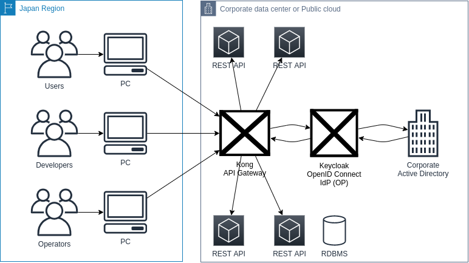

# <!-- fit --> (第7回WSA研) マルチクラウド対応の認可アーキテクチャ
<!-- _class: [lead, invert] -->
<!-- _footer: '本記事に書かれている内容は個人的な見解であり、私が所属する組織の見解は含まれず、所属組織とは一切関係ありません' -->

2020/11/07 Takumi Takahashi

## はじめに

製造業におけるIoTシステム開発など、特殊なシステムアーキテクチャが必要とされる場合において、DevSecOpsを前提とした認証・認可アーキテクチャのあり方を模索してみました。

## 謝辞とお詫び

- このような場に迎え入れてくださり、ありがとうございました :pray:
- 本発表に先立ち、様々な資料や文献、製品等の調査を進める過程で
  自身の知識不足であることが明確になりました
- また、既存製品・研究・規格の調査で時間切れとなってしまい
  着想を具現化するに至りませんでした
- このようなレベルの高い場に出席させていただきながら
  個人のメモ書きレベルになってしまったこと、深くお詫びします

## 背景

- 一般的な製造業は物理世界との結びつきが強いという特性上
  製造業に特化した技術が数多くありますが、昨今IoTなどの
  キーワードを旗印に、徐々にですがWebに由来する技術が
  取り入れられつつあります
- ですが、近年サイバーセキュリティに関する関連法規の具体化
  など、素人がWebシステム開発するには、非常に厳しい世界に
  なっている現実もあります
- 以上の背景から、元組み込みエンジニアの観点を取り入れ、
  素人でも安心してソフトウェア開発できる、汎用的な認証認可の
  仕組みを考案してみました

## 認証と認可について

- 認証とは
  - 「通信相手が誰（何）であるか」を確認すること
- 認可とは
  - 「対象となるリソースへのアクセス制御」を行うこと
- 本資料では認可に着目し、汎用的な認証認可の仕組みを考案します

## 対象となるソフトウェアシステム

- REST APIサーバー
  - OpenAPI等、スキーマ定義が外部化でき、また枯れた実装も多く、初心者でも始めやすい環境が整っていると考えています

## 関連するソフトウェアシステム

- API Gateway
  - 上述したOpenAPI等のスキーマ定義を用いて、リソース(API)のルーティング、スループット制限等、システムとは直接関係のないリソース管理を行います
- OpenID Connect IdP (OP)
  - 一般的な企業ではLDAPやActive Directory等、既存ディレクトリサービスが導入されているケースが多く、また従業員情報や機器情報は一種の資産であり、これらの情報を認可情報源として活用することで、システム開発者とシステム運用者の権限分離を図ります

## 認可方式

- 前述した各種情報資産を利活用でき、また将来に対しての拡張性を考慮した上で、ABAC ( Attribute Based Access Control ) の方式とします
- 例えば従業員情報として、ID, パスワード, メールアドレス, 所属情報等の情報が予め入力されている事が多く、これらの情報をシステムごとに投入せずに活用できることで、設計・開発工数を削減します

## 既存製品・規格

- 既存実装としてはパブリッククラウドではAWS, GCP, Azure等、各社製品をリリースされています
- 国内ではAuthlete社が、FAPI(Financial API)グレードの認証認可に特化した製品をリリースされています
- いずれの製品で共通している機能として、OpenID Connectを用いた認証認可の仕組みを提供されています

## OpenID Connect について

- OpenID Connectの出自はOAuth 2.0が起源で、SAML 2.0等の既存認証認可の仕組みを取り入れた規格となっています
- OAuth 2.0やSAML 2.0、OpenID Connect等の規格そのものはとても巨大であり、またWeb上に各種資料がありますので、本資料では規格そのものについては具体的に言及しませんが、本資料のスコープであるABACによる認可を行うにあたり、OpenID Connect Core SpecであるUserInfo Request/Responseにフォーカスをあてます

## これまでのまとめ

- REST APIサーバーを対象としたAPI Gateway, OpenID Connect IdPを用意することで、REST APIサーバー実装担当はCRUD実装に注力することが可能になる
- 同時にREST APIサーバー等Webシステム開発の経験が浅い開発者でも、コンテナ等の技術を活用することで、OJT形式で技術のキャッチアップが可能になる
- またAPI Gateway, OpenID Connect IdPを採用することで、中央集約的にセキュリティ対策やコンプライアンス、ガバナンスが可能になる

## 検討したミニマムアーキテクチャ

## API Gateway (Kong) について

- API Gatewayとしての採用実績が多く、またコアとなるはNGINXであるため、[matsumotory/ngx_mruby](https://github.com/matsumotory/ngx_mruby)など、ダイナミックなABACが可能になる
- また、Lua言語による拡張方式や、Go言語による拡張方式、あるいはRust等によるFFIも考慮に入るため、ABACの難しさを考慮した上で採用

## OpenID Connect IdP (Keycloak) について

- 既に金融業界での導入実績等があり、またOCIコンテナを用いると、容易にHAクラスタ展開が可能であることなどから採用

- 日立製作所 OSSソリューションセンタ 中村 雄一様
  オープンAPIに求められる認可認証OSSセキュリティ技術
  - https://www.iwsec.org/ows/2019/Materials/CSS2019_Nakamura.pdf

## 今後について

- 本資料では事前調査と構成検討だけで終始してしまったため、今後はABAC認可の実現を目指します

## 最後に

本記事に書かれている内容は個人的な見解であり、私が所属する組織の見解は含まれず、所属組織とは一切関係ありません
